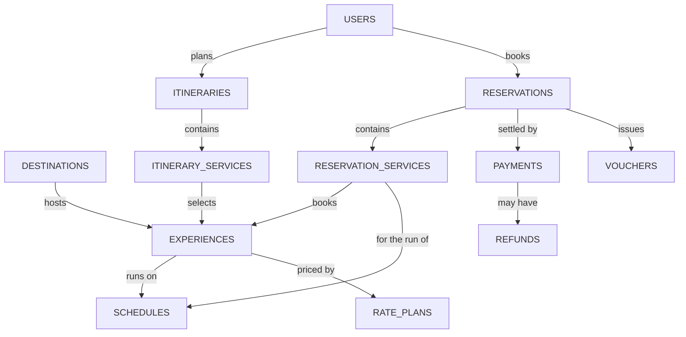
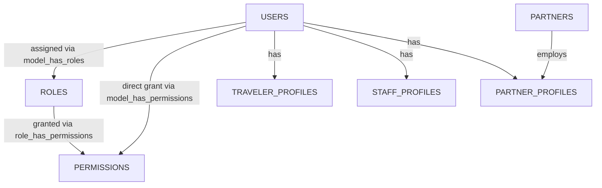
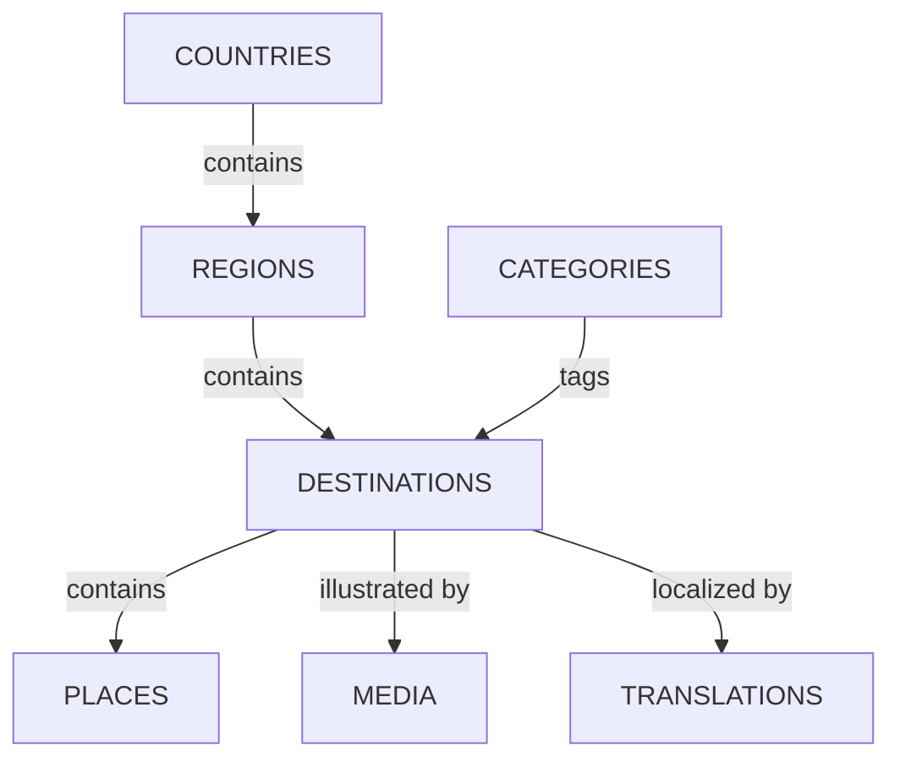
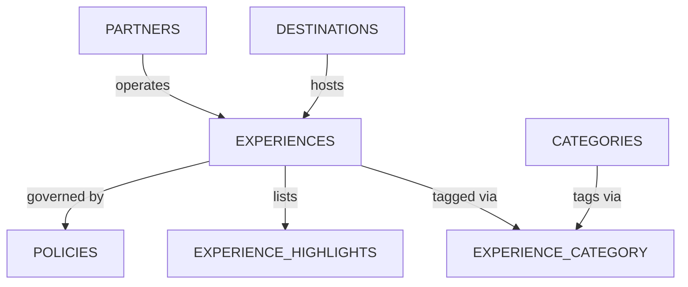
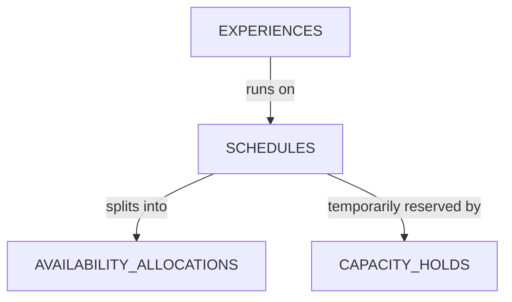
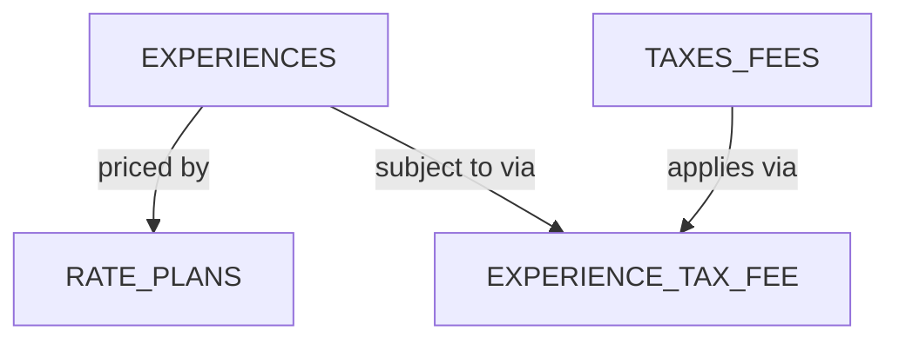
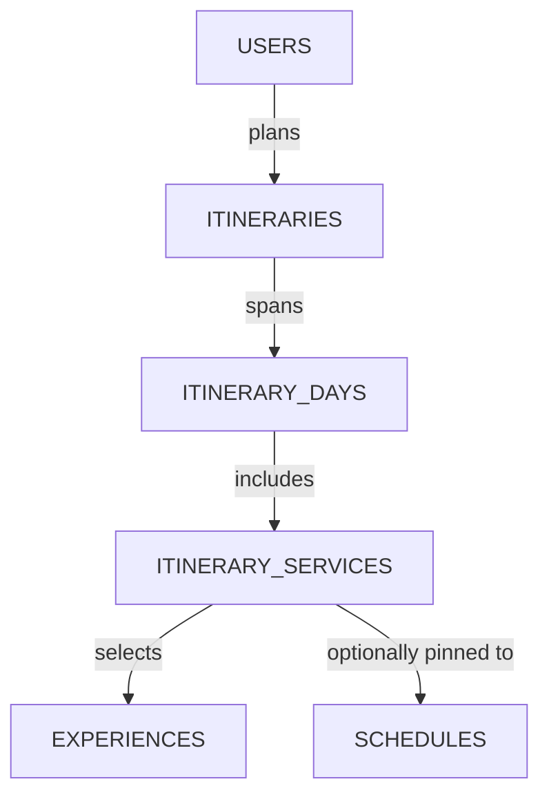
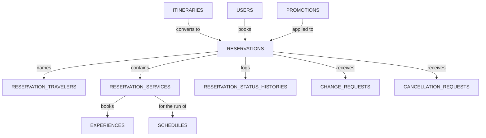
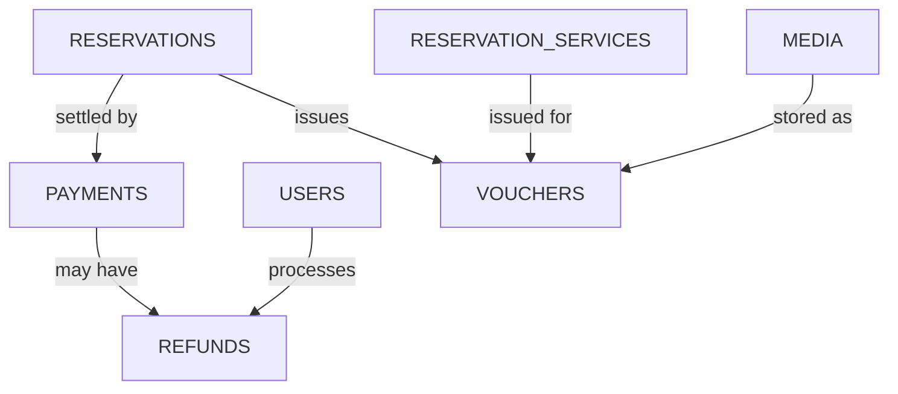

# Tourism Tech — Database Schema (ER Diagram)

**Scope:** Phase 1 (Foundation) + Phase 2 (Reservations) of the platform roadmap
**Stack:** Laravel 13, PHP 8.3, MySQL 8, Redis (cache/queues/holds), JWT auth (tymon/jwt-auth, guard `api`), RBAC via spatie/laravel-permission
**Structure:** DDD-style bounded domains (`app/Domains/<Domain>`), following the same pattern as the Imperial Cart System backend

This document tracks the relational schema for the Axoten Tourism Tech backend. Tables marked **Built** are live in the actual repo as of 2026-08-31; everything else is planned but not yet migrated.

---

## How to read this

- `→` on a foreign key column means "references."
- **PK** = primary key, **FK** = foreign key, **UK** = unique key/index.
- A composite primary key (used on pivot tables) is marked **PK, FK** on each column that makes up the key together.
- Flowchart arrows are labeled with the relationship itself (e.g. "hosts," "books") — read them as "left table relates to right table, like this."

---

## Overview

8 domains, 34 tables, in dependency order — each domain below only references tables from domains listed before it, so this is also a valid build order.

1. [Identity](#1-identity)
2. [Destinations](#2-destinations)
3. [Experiences](#3-experiences)
4. [Availability](#4-availability)
5. [Pricing](#5-pricing)
6. [Itineraries](#6-itineraries)
7. [Reservations](#7-reservations)
8. [Payments](#8-payments)

---

## 1. Identity

Travelers, staff, partners, sessions, roles, and permissions. Every other domain hangs a `user_id` off this one.

Implemented on the real backend via **tymon/jwt-auth** (stateless JWT, guard `api`) and **spatie/laravel-permission** for full RBAC — not a simplified single `role_id` column. `roles`/`permissions` through `partners` below are **Built**; `traveler_profiles`, `staff_profiles`, and `partner_profiles` are planned, not yet migrated.

#### `roles` — Built (spatie/laravel-permission)
| Column | Type | Key | Notes |
|---|---|---|---|
| id | bigint | PK | |
| name | string | | traveler / travel-agent / operations-officer / content-editor / finance-officer / partner-user / administrator / super-administrator |
| guard_name | string | | "api" |

#### `permissions` — Built (spatie/laravel-permission)
| Column | Type | Key | Notes |
|---|---|---|---|
| id | bigint | PK | |
| name | string | | 18 seeded — dashboard, destinations, experiences, availability, pricing, itineraries, reservations, payments, refunds, partners, content, support, reports, audit, settings, users |
| guard_name | string | | "api" |

#### `model_has_roles` — Built (pivot, polymorphic)
| Column | Type | Key | Notes |
|---|---|---|---|
| role_id | bigint | PK, FK | → roles.id |
| model_type | string | PK | "App\Models\User" today |
| model_id | bigint | PK | → users.id |

#### `model_has_permissions` — Built (pivot, polymorphic)
| Column | Type | Key | Notes |
|---|---|---|---|
| permission_id | bigint | PK, FK | → permissions.id |
| model_type | string | PK | "App\Models\User" |
| model_id | bigint | PK | → users.id — a permission granted straight to one user, bypassing roles |

#### `role_has_permissions` — Built (pivot)
| Column | Type | Key | Notes |
|---|---|---|---|
| permission_id | bigint | PK, FK | → permissions.id |
| role_id | bigint | PK, FK | → roles.id |

#### `users` — Built
| Column | Type | Key | Notes |
|---|---|---|---|
| id | bigint | PK | |
| name | string | | |
| email | string | UK | |
| email_verified_at | timestamp | | nullable |
| phone | string | | |
| password | string | | hashed |
| status | string | | active / suspended / pending — planned, not yet a real column |
| created_at, updated_at | timestamp | | |
| deleted_at | timestamp | | soft delete, nullable |

#### `traveler_profiles` — Planned, not yet built
| Column | Type | Key | Notes |
|---|---|---|---|
| id | bigint | PK | |
| user_id | bigint | FK, UK | → users.id, one profile per user |
| date_of_birth | date | | |
| nationality | string | | |
| passport_number | string | | |
| emergency_contact_name | string | | |
| emergency_contact_phone | string | | |
| loyalty_tier | string | | |
| loyalty_points | int | | |
| preferences | json | | |

#### `staff_profiles` — Planned, not yet built
| Column | Type | Key | Notes |
|---|---|---|---|
| id | bigint | PK | |
| user_id | bigint | FK, UK | → users.id |
| department | string | | |
| employee_code | string | UK | |
| hire_date | date | | |

#### `partner_profiles` — Planned, not yet built
| Column | Type | Key | Notes |
|---|---|---|---|
| id | bigint | PK | |
| user_id | bigint | FK, UK | → users.id |
| partner_id | bigint | FK | → partners.id |
| job_title | string | | |

#### `partners` — minimal, see notes
| Column | Type | Key | Notes |
|---|---|---|---|
| id | bigint | PK | |
| name | string | | |
| partner_type | string | | hotel / transport_provider / tour_operator / guide / activity_provider |

**Decisions**
- The real backend uses spatie/laravel-permission's full RBAC instead of a flat `role_id` — the 18 seeded permissions already anticipate the full product surface even though only Identity is built today.
- Auth is JWT (tymon/jwt-auth, guard `api`), not Sanctum — access tokens carry `expires_in` plus a `refresh-token` endpoint, matching what the Client Frontend's bearer-token auth already expects.
- Guest checkout stays possible: `reservations.user_id` and `itineraries.user_id` are both nullable rather than forcing a Traveler profile up front.
- `partners` is shown here only as the entity Partner Profiles attach to — its full agreements/documents/settlement shape belongs to the Phase 3 Partners domain.

---

## 2. Destinations

Countries, regions, places, maps, media, and translations — the geography Experiences get hosted on. Not yet built.

#### `countries`
| Column | Type | Key | Notes |
|---|---|---|---|
| id | bigint | PK | |
| name | string | | |
| iso_code | string | UK | ISO 3166-1 alpha-2 |

#### `regions`
| Column | Type | Key | Notes |
|---|---|---|---|
| id | bigint | PK | |
| country_id | bigint | FK | → countries.id |
| name | string | | |
| slug | string | | |

#### `categories` (shared with Experiences)
| Column | Type | Key | Notes |
|---|---|---|---|
| id | bigint | PK | |
| name | string | | e.g. Beach, Wildlife, Historical, Adventure, Camping, Hiking |
| slug | string | UK | |
| applies_to | string | | destination / experience |

#### `destinations`
| Column | Type | Key | Notes |
|---|---|---|---|
| id | bigint | PK | |
| region_id | bigint | FK | → regions.id |
| category_id | bigint | FK | → categories.id |
| name | string | | |
| slug | string | UK | |
| short_description | text | | |
| description | text | | |
| latitude, longitude | decimal | | |
| rating_avg | decimal | | |
| rating_count | int | | |
| status | string | | draft / review / scheduled / published / archived |
| published_at | timestamp | | nullable |
| deleted_at | timestamp | | soft delete, nullable |

#### `places`
| Column | Type | Key | Notes |
|---|---|---|---|
| id | bigint | PK | |
| destination_id | bigint | FK | → destinations.id |
| name | string | | |
| place_type | string | | landmark / viewpoint / temple / beach / trail |
| description | text | | |
| latitude, longitude | decimal | | |

#### `media` (polymorphic, shared platform-wide)
| Column | Type | Key | Notes |
|---|---|---|---|
| id | bigint | PK | |
| mediable_type | string | | Destination / Place / Experience |
| mediable_id | bigint | | polymorphic target id |
| disk | string | | public / private |
| path | string | | |
| media_type | string | | image / document / video |
| alt_text | string | | |
| sort_order | int | | |

#### `translations` (polymorphic, shared platform-wide)
| Column | Type | Key | Notes |
|---|---|---|---|
| id | bigint | PK | |
| translatable_type | string | | polymorphic |
| translatable_id | bigint | | polymorphic target id |
| locale | string | | |
| field_key | string | | e.g. "description" |
| value | text | | |

**Decisions**
- `media` and `translations` are polymorphic and shared platform-wide — defined once, reused by Destinations, Places, and Experiences instead of a table per entity.
- Content workflow states (`draft → review → scheduled → published → archived`) live directly on `destinations.status`, matching the Admin Panel's Travel Content area.

---

## 3. Experiences

Packages, activities, stays, transfers, guides, and the policies attached to them — what a traveler actually books. Not yet built.

#### `experiences`
| Column | Type | Key | Notes |
|---|---|---|---|
| id | bigint | PK | |
| destination_id | bigint | FK | → destinations.id |
| partner_id | bigint | FK | → partners.id, nullable |
| experience_type | string | | package / activity / hotel_stay / transfer / guide_service |
| title | string | | |
| slug | string | UK | |
| short_description | text | | |
| description | text | | |
| duration_days, duration_nights | int | | |
| min_group_size, max_group_size | int | | |
| base_price | decimal(12,2) | | display price only — see Pricing domain |
| currency | char(3) | | ISO 4217, e.g. USD |
| rating_avg | decimal | | |
| rating_count | int | | |
| status | string | | draft / review / scheduled / published / archived |
| published_at | timestamp | | nullable |
| deleted_at | timestamp | | soft delete, nullable |

#### `experience_category` (pivot)
| Column | Type | Key | Notes |
|---|---|---|---|
| experience_id | bigint | PK, FK | → experiences.id |
| category_id | bigint | PK, FK | → categories.id |

#### `experience_highlights`
| Column | Type | Key | Notes |
|---|---|---|---|
| id | bigint | PK | |
| experience_id | bigint | FK | → experiences.id |
| title | string | | e.g. "Sigiriya Rock climb" |
| description | text | | |
| sort_order | int | | |

#### `policies` (polymorphic)
| Column | Type | Key | Notes |
|---|---|---|---|
| id | bigint | PK | |
| policyable_type | string | | Experience today |
| policyable_id | bigint | | polymorphic target id |
| policy_type | string | | cancellation / payment / age_requirement / health_safety |
| title | string | | |
| body | text | | |

**Decisions**
- An experience carries one `base_price`/`currency` for card display, while the real bookable price comes from Pricing's `rate_plans` — mirrors how the live site shows "From $250" while the cart totals in LKR.
- `policies` is polymorphic so Reservations can later attach its own policy snapshot without a schema change.

---

## 4. Availability

Schedules, capacity, allocations, holds, and release rules — the mechanism that stops two travelers buying the same last seat. Not yet built.

#### `schedules`
| Column | Type | Key | Notes |
|---|---|---|---|
| id | bigint | PK | |
| experience_id | bigint | FK | → experiences.id |
| starts_at, ends_at | datetime | | stored UTC |
| timezone | string | | IANA tz, e.g. Asia/Colombo |
| capacity_total | int | | |
| notice_period_hours | int | | |
| cut_off_at | datetime | | |
| status | string | | open / closed / cancelled |

#### `availability_allocations`
| Column | Type | Key | Notes |
|---|---|---|---|
| id | bigint | PK | |
| schedule_id | bigint | FK | → schedules.id |
| resource_type | string | | seat / room / vehicle / guide_slot |
| capacity_available | int | | |
| capacity_held | int | | |
| capacity_booked | int | | |

#### `capacity_holds`
| Column | Type | Key | Notes |
|---|---|---|---|
| id | bigint | PK | |
| schedule_id | bigint | FK | → schedules.id |
| reservation_id | bigint | FK | → reservations.id, nullable until confirmed |
| quantity | int | | |
| hold_token | string | | |
| expires_at | timestamp | | |
| status | string | | active / released / converted |

**Decisions**
- `capacity_holds.expires_at` is the durable record of a hold; Redis mirrors it for fast reads and lets the Laravel Scheduler expire holds without a full table scan.
- Dates are UTC platform-wide except each `schedules` row, which also stores its own local `timezone`.

---

## 5. Pricing

Rate plans, seasons, traveler types, taxes, fees, benefits, and currencies. Not yet built.

#### `rate_plans`
| Column | Type | Key | Notes |
|---|---|---|---|
| id | bigint | PK | |
| experience_id | bigint | FK | → experiences.id |
| traveler_type | string | | adult / child / infant / student / senior |
| season_start_date, season_end_date | date | | |
| base_amount | decimal(12,2) | | |
| currency | char(3) | | |

#### `taxes_fees`
| Column | Type | Key | Notes |
|---|---|---|---|
| id | bigint | PK | |
| name | string | | |
| calc_type | string | | percentage / fixed |
| value | decimal(12,4) | | |
| applies_to_scope | string | | all / experience / destination |

#### `experience_tax_fee` (pivot)
| Column | Type | Key | Notes |
|---|---|---|---|
| experience_id | bigint | PK, FK | → experiences.id |
| tax_fee_id | bigint | PK, FK | → taxes_fees.id |

#### `promotions`
| Column | Type | Key | Notes |
|---|---|---|---|
| id | bigint | PK | |
| code | string | UK | |
| description | string | | |
| discount_type | string | | percentage / fixed |
| discount_value | decimal(12,2) | | |
| starts_at, ends_at | timestamp | | |
| usage_limit | int | | |
| times_used | int | | |
| status | string | | active / expired / disabled |

**Decisions**
- Every monetary column is `decimal(12,2)` (or `decimal(12,4)` for a percentage rate) — never float — the same bcmath-safe precision rule used on the Imperial Cart System's monetary fields.
- `promotions` stands alone here; it's linked to a specific booking only once a reservation applies it.

---

## 6. Itineraries

Trip days, services, timing, locations, and custom requests — a traveler's plan before it becomes a booking. Not yet built.

#### `itineraries`
| Column | Type | Key | Notes |
|---|---|---|---|
| id | bigint | PK | |
| user_id | bigint | FK | → users.id, nullable — guest itineraries allowed |
| status | string | | draft / shared / converted |
| title | string | | |
| adults_count, children_count | int | | |
| notes | text | | |

#### `itinerary_days`
| Column | Type | Key | Notes |
|---|---|---|---|
| id | bigint | PK | |
| itinerary_id | bigint | FK | → itineraries.id |
| day_number | int | | |
| day_date | date | | |
| notes | text | | |

#### `itinerary_services`
| Column | Type | Key | Notes |
|---|---|---|---|
| id | bigint | PK | |
| itinerary_day_id | bigint | FK | → itinerary_days.id |
| experience_id | bigint | FK | → experiences.id |
| schedule_id | bigint | FK | → schedules.id, nullable until a date is chosen |
| quantity | int | | |
| sort_order | int | | |

**Decisions**
- An itinerary can exist without ever becoming a reservation — sharing a trip plan or requesting a custom itinerary from an agent only needs Identity + this domain, no payment involved.

---

## 7. Reservations

References, participants, services, states, and amendments — the immutable record of what a traveler actually bought. Not yet built.

#### `reservations`
| Column | Type | Key | Notes |
|---|---|---|---|
| id | bigint | PK | |
| reservation_reference | string | UK | traveler-facing id, e.g. TT-2026-000482 |
| itinerary_id | bigint | FK | → itineraries.id, nullable |
| user_id | bigint | FK | → users.id, nullable — guest checkout |
| promotion_id | bigint | FK | → promotions.id, nullable |
| status | string | | draft / quoted / pending_payment / payment_processing / confirmed / in_progress / completed / expired / payment_failed / change_requested / cancellation_requested / cancelled / refund_pending / refunded |
| currency | char(3) | | |
| subtotal_amount | decimal(12,2) | | |
| tax_amount | decimal(12,2) | | |
| fee_amount | decimal(12,2) | | |
| discount_amount | decimal(12,2) | | |
| total_amount | decimal(12,2) | | |
| quote_expires_at | timestamp | | |
| confirmed_at | timestamp | | nullable |

#### `reservation_travelers`
| Column | Type | Key | Notes |
|---|---|---|---|
| id | bigint | PK | |
| reservation_id | bigint | FK | → reservations.id |
| full_name | string | | |
| date_of_birth | date | | |
| passport_number | string | | |
| traveler_type | string | | adult / child / infant |
| special_requirements | text | | |

#### `reservation_services`
| Column | Type | Key | Notes |
|---|---|---|---|
| id | bigint | PK | |
| reservation_id | bigint | FK | → reservations.id |
| experience_id | bigint | FK | → experiences.id |
| schedule_id | bigint | FK | → schedules.id |
| quantity | int | | |
| unit_price | decimal(12,2) | | price snapshot, immutable |
| tax_amount | decimal(12,2) | | |
| fee_amount | decimal(12,2) | | |
| total_price | decimal(12,2) | | |
| status | string | | pending / confirmed / cancelled |

#### `reservation_status_histories` (audit log)
| Column | Type | Key | Notes |
|---|---|---|---|
| id | bigint | PK | |
| reservation_id | bigint | FK | → reservations.id |
| previous_status, new_status | string | | |
| actor_type | string | | system / traveler / staff |
| actor_id | bigint | | nullable |
| reason | text | | |
| created_at | timestamp | | |

#### `change_requests`
| Column | Type | Key | Notes |
|---|---|---|---|
| id | bigint | PK | |
| reservation_id | bigint | FK | → reservations.id |
| requested_by | bigint | FK | → users.id |
| request_type | string | | date_change / participant_change / service_change |
| details | json | | |
| status | string | | pending / approved / rejected |
| reviewed_by | bigint | FK | → users.id, nullable |
| reviewed_at | timestamp | | nullable |

#### `cancellation_requests`
| Column | Type | Key | Notes |
|---|---|---|---|
| id | bigint | PK | |
| reservation_id | bigint | FK | → reservations.id |
| requested_by | bigint | FK | → users.id |
| reason | text | | |
| status | string | | pending / approved / rejected |
| reviewed_by | bigint | FK | → users.id, nullable |
| reviewed_at | timestamp | | nullable |

**Decisions**
- `reservation_services.unit_price/total_price` are copied at booking time and never recalculated from `rate_plans` — confirmed prices stay immutable, so a later rate change can't move a paid total.
- `reservation_status_histories` gives every transition an actor, a reason, and a timestamp; Laravel enforces which transitions are legal, neither frontend sets status directly.
- `reservations.reservation_reference` is the traveler-facing ID; `id` stays internal.

---

## 8. Payments

Attempts, confirmations, balances, callbacks, and refunds. Not yet built.

#### `payments`
| Column | Type | Key | Notes |
|---|---|---|---|
| id | bigint | PK | |
| reservation_id | bigint | FK | → reservations.id |
| provider | string | | e.g. stripe, payhere |
| provider_reference | string | UK | |
| amount | decimal(12,2) | | |
| currency | char(3) | | |
| payment_type | string | | full / partial / deposit |
| status | string | | pending / processing / succeeded / failed / refunded |
| callback_payload | json | | signed provider webhook body |
| paid_at | timestamp | | nullable |

#### `refunds`
| Column | Type | Key | Notes |
|---|---|---|---|
| id | bigint | PK | |
| payment_id | bigint | FK | → payments.id |
| amount | decimal(12,2) | | |
| reason | text | | |
| status | string | | pending / approved / processed / rejected |
| processed_by | bigint | FK | → users.id, nullable |
| processed_at | timestamp | | nullable |

#### `vouchers`
| Column | Type | Key | Notes |
|---|---|---|---|
| id | bigint | PK | |
| reservation_id | bigint | FK | → reservations.id |
| reservation_service_id | bigint | FK | → reservation_services.id, nullable — whole-trip vs single-service |
| voucher_type | string | | voucher / receipt / itinerary |
| media_id | bigint | FK | → media.id, nullable — generated PDF |
| issued_at | timestamp | | |

**Decisions**
- Card data never touches this schema — `payments.provider_reference` and `callback_payload` are what a hosted payment component and its signed webhook leave behind.
- `refunds` links to `payments`, not `reservations`, directly — a reservation's total refunded is always one honest sum instead of a second number that can drift.

---

## Scope note

Left out on purpose: full **Partners** (agreements, settlements), **Content** (articles/FAQ), **Reviews**, **Communications**, **Support**, and **Reporting & Audit** — those belong to Phase 3 (Admin Operations) and Phase 4 (Traveler Services) of the platform roadmap, not this Phase 1+2 slice.

## Conventions

- snake_case tables & columns
- `bigint` auto-increment `id`
- `created_at` / `updated_at` on every table
- soft deletes on content & catalog tables
- money as `decimal(12,2)`, never float

## Sources

- Tourism Tech platform knowledge doc (2026-08-19)
- Live client frontend — tourism-tech-srilanka.vercel.app
- Axoten Tourism Tech backend progress snapshot (2026-08-31)
- Domain-grouping pattern from the Imperial Cart System
